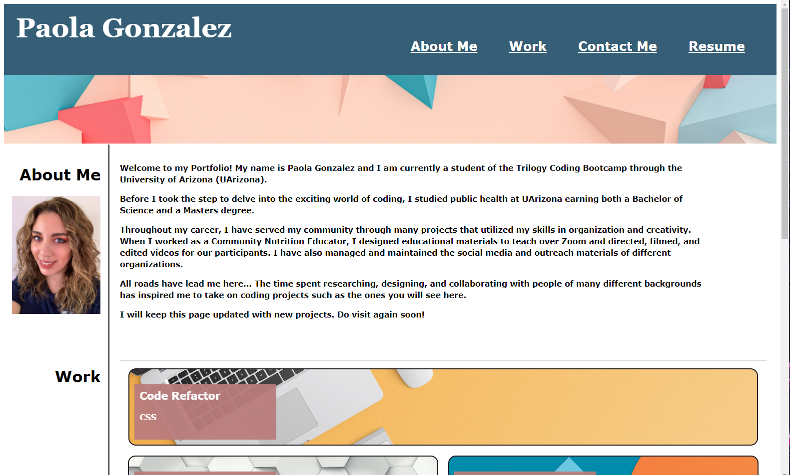

# Portfolio

## Table of Contents

* Description
* Usage
* Images
* License

---

## Description
> Goals of this assignment included the following:

1. Apply learned HTML and CSS syntax and formatting to create a Porfolio webpage from scratch.

2. Stylize the Portfolio using CSS properties and values such as flexbox.

3. Use media queries and other CSS properties to create a responsive layout that adapts to the user's viewport.

4. Include working links to deployed web applications that showcase my projects. (Placeholder images should be added and their links updated as web applications are completed)

6. Link potential employers to my contact information and public profiles such as GitHub and LinkedIn.

---

## Usage
> The purpose of this project is to create a Portfolio that will be continuously updated and shared with potential employers. 

Access the webpage here:

<https://pao1ag.github.io/Portfolio/>

---

## Images

## License

This project is licensed under MIT License.